# Claudette

> This was made for my own usage, its not meant for everyone. Started as an experiment when Anthropic sent me some free cloud time.

**Your friendly neighborhood Claude Code wrapper.** Claudette puts [Claude Code](https://code.claude.com/docs) in a real desktop window: every session in its own tab, every change ready to review, and your plan's usage on screen the whole time, so you never have to run `/usage` again.

It isn't a reimplementation. Each tab runs the real `claude` CLI, with your settings, `CLAUDE.md`, MCP servers, hooks and permissions, and Claudette draws it as proper native UI instead of a terminal. Windows and macOS, built with .NET 10 and Avalonia.

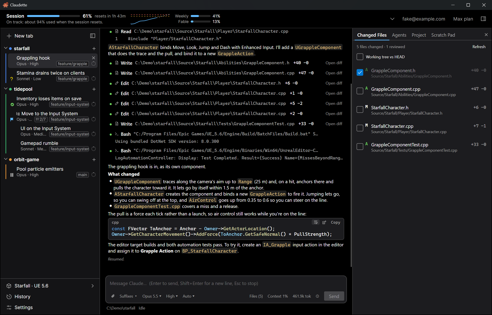

## Why you'll want it

### Run a dozen sessions without losing track of any

- **One tab per session**, grouped by project folder in a sidebar that fits long names, a status line and as many tabs as you like. Each group gets its own color.
- **See where each tab stands at a glance:** busy, needs input, failed or idle, plus its git branch or worktree, its model and effort, how far its task list has got (`2/7`), and a ring that fills up with its context window.
- **Mark tabs your way** with a check, cross, question mark, star, flag or pause sign. Once every file a tab changed is reviewed, it gets a green **reviewed** badge on its own.
- **`Ctrl+J` jumps to the next tab waiting for you**, so a permission prompt never sits unanswered behind another tab. `Ctrl+Shift+P` opens a command palette for everything else.
- **Worktree tabs** give a session its own git worktree and branch, so parallel tabs in one repository never trip over each other's edits. Claudette runs your setup steps in each new worktree, and can clean up the ones you've merged.
- **Sessions that know each other.** Each tab's session goes by the tab's name in Claude Code, so other sessions can message it by name. Type `@` in the composer to name another tab, another Claude Code session on this machine or one of the tab's subagents, and Claude is told how to reach it.
- **Pinned tabs come back** every time you launch, resuming exactly where they left off.

### Plans, tasks and threads

- **Follow the plan.** The Tasks page shows Claude's plan as it writes it in Plan mode, keeps every version with **Changes from** the one before, and lists the tasks Claude makes from it.
- **Watch the tasks get done:** each task with who's on it, how long it took, the files it changed and the tokens it used. A rule in the conversation marks where each one starts, the status line and the tab's row say how far the list has got, and a turn that ends with tasks left offers **Continue**.
- **Threads** spread one job over several tabs. Make a tab a thread, and its Claude hands work to the other tabs in its project, its sub-threads, with Claude Code's own `SendMessage`. You approve each message first (or turn that off), each sub-thread stays a whole tab you can watch, steer and answer, and their results come back to the thread in one message, so the thread spends one turn on them, not one each. A sub-thread's permission prompt shows in the thread too, to answer from there.

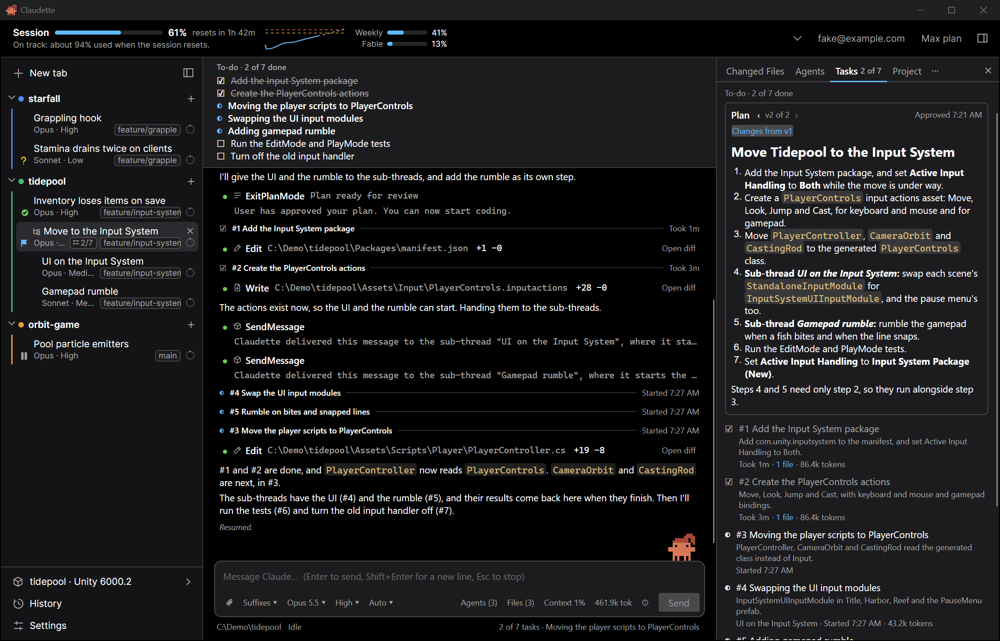

### Watch the agents work

- **The agent map** shows Claude's subagents as a tree while they fan out, nested as they nest, with what each is doing right now. Select one for what it was asked, what it returned, its time, tool calls and tokens, or stop it. It sits in the side panel, or in a window of its own for wide fan-outs.
- **Background work stays in sight:** a chip counts what Claude Code keeps running after a turn ends (background commands, Monitor watches, background subagents), with Stop for each.
- **Ultracode**, a switch per tab, lets Claude run workflows of subagents on its own for big tasks.

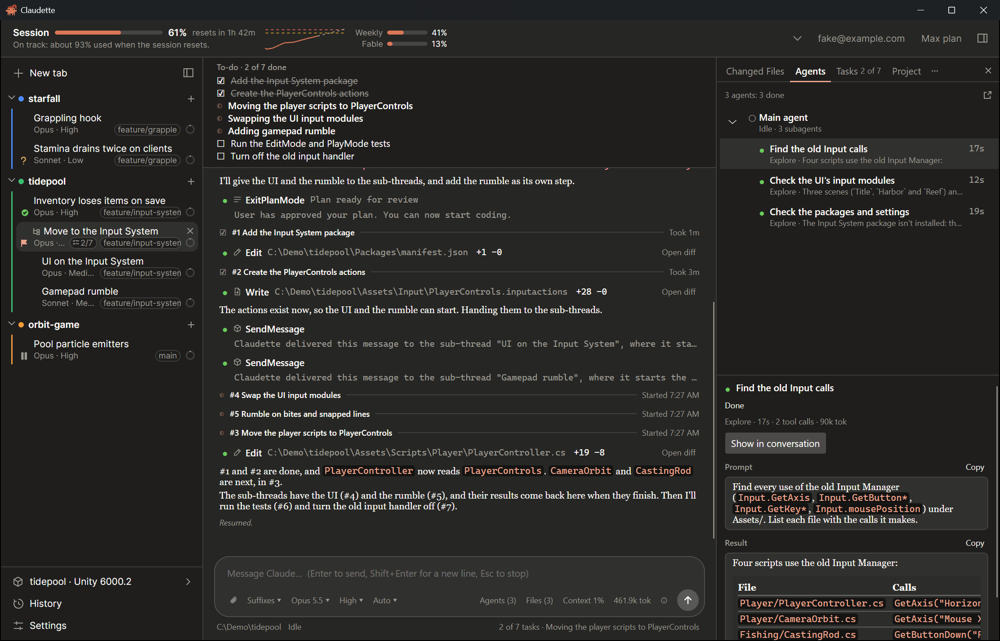

### Know how fast you're burning your plan

- **Live meters** for the 5-hour session, the weekly limit and each model-specific limit, with reset countdowns, right in the header.
- **A trendline with a projection:** *"On track: about 70% used when the session resets"*, or a warning in amber and red: *"At this rate you'll hit the limit in 1h 05m"*.
- **Open the header up** with its chevron for the full picture, without leaving your work: this session's chart, with the warning and critical bands and exactly when you'll cross them (*"Hits 90% at 10:59 PM, 12m before it resets"*), the week day by day with each model-specific limit, your burn rate per hour, the time left at that rate, and the three tabs burning the most.
- **Alerts** when you cross a threshold or are on course to hit the limit, and a Usage window with past sessions and weeks.
- **Hit the limit mid-task? Go to bed.** The tab waits for the reset and carries on with the task by itself.
- **Several computers?** They can share their readings, so every machine's header knows what the others used.

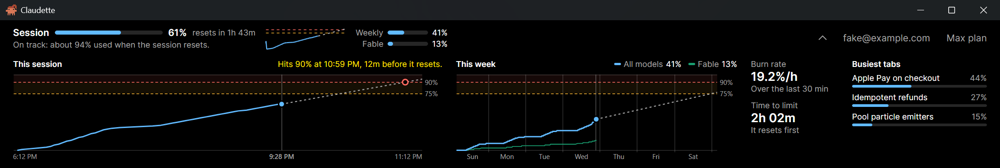

### Review every change Claude makes

- **Changed files**, live, with `+/−` counts, for everything the session touched, or for the whole working tree against `HEAD`.
- **A real diff view** in its own window, side by side or inline, syntax highlighted, with **Revert** for a single hunk or the whole file.
- **Tick files as reviewed.** A tick sticks until Claude edits that file again, survives restarts and follows the session to your other machines.
- **Every turn says what it changed:** *"3 files changed"*, one click from each file's diff for just that turn.
- **Prefer your own tools?** Send diffs to Beyond Compare, VS Code, WinMerge, Kaleidoscope, Meld, P4Merge or your git difftool, or open the file in your editor.

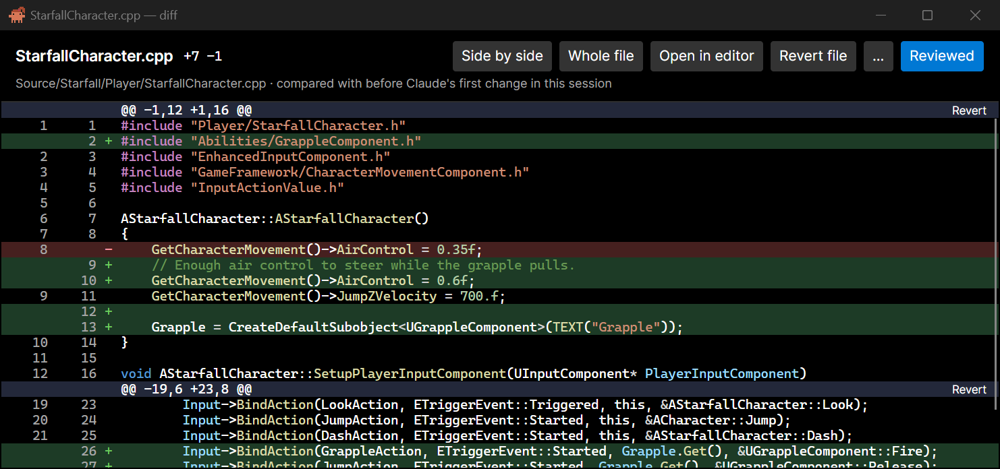

### A conversation built for code

- Replies render as Markdown with syntax-highlighted code blocks and one-click **Copy**. Tool calls are compact rows that expand when you want the detail.
- **Permission prompts, questions and plans are cards**, not walls of text: Allow, Always allow, Deny, a plan to approve or send back, a question with its choices.
- **Steer while Claude works:** messages you send mid-turn reach it at the next tool call, or wait for the turn to end if you'd rather, with **Send now** for one that can't wait. If a turn goes quiet for too long, Claudette checks in, and if nothing answers it flags the tab as possibly stuck so it doesn't burn your plan unnoticed.
- **Rewind and branch** from any earlier message, putting the files back too, or edit a message and send it again. **Find**, **export** to Markdown or a web page, **quote** part of a reply in your answer.
- **A composer that keeps up:** slash commands and `@` autocomplete for files, tabs and agents, images and large pastes as attachments, prompt recall, drafts that survive a restart, a stash for half-written ideas, and quick suffixes for the instructions you add every time.
- **Per-tab model, effort and permission mode,** switched from the composer bar.

### Pick up anywhere

- **History** lists past sessions by project, with a chip for each project to narrow it to one, and searches through Claude's replies, not just your prompts. **History for this folder**, on a sidebar group, opens it on that project.
- **The session library** syncs the sessions you choose through any folder Dropbox, Google Drive or OneDrive keeps up to date. Open one on your laptop and carry on from where your desktop stopped.
- **Remote Control:** connect a tab to the Claude app and keep the conversation going from your phone while your computer does the work. Claudette keeps it awake meanwhile.
- **A scratch pad per project** for the commands, notes and snippets worth keeping, shared by every tab in that project and synced with the rest.

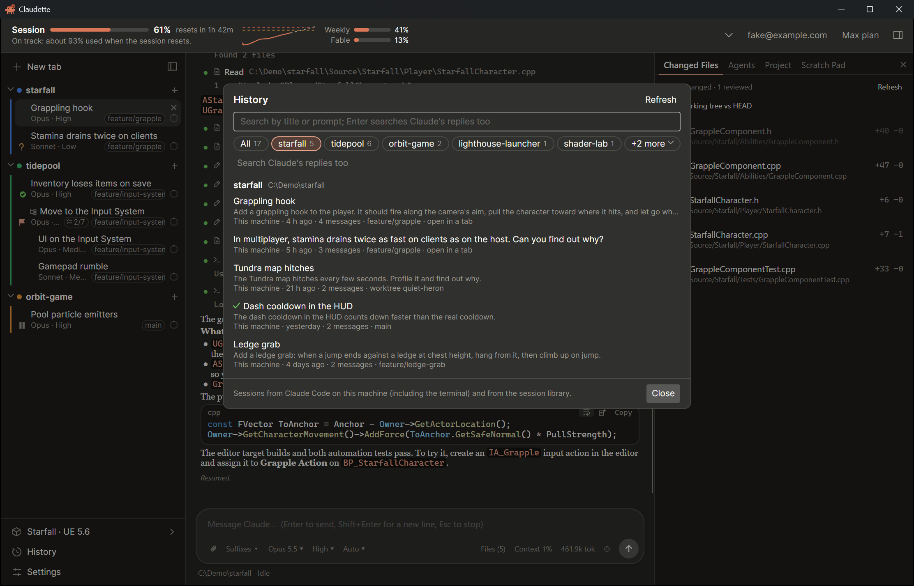

### It knows your project

- **Project tools** for Unreal Engine, Unity and Godot: launch the editor, generate project files, build, open the solution in your IDE (Rider too). Each run gets its log, its status and a Stop button. Any folder can add its own actions and links in a `claudette.json`.
- **The process monitor** lists the dev servers, test runs and builds a tab started, as a tree under its `claude`, with their CPU, memory, running time and arguments. Collapse a branch to see what it adds up to, and jump from a process to the command that started it.
- **MCP servers** at a glance, with their status and the input they ask for.
- **Perforce, too:** ticket handling and the tab's changelist, with passwords kept in your OS's credential store.

### Two looks, light and dark

**Standard** follows Claude Code's VS Code extension: dense, calm and in your OS's accent color. **Claude** takes after the Claude apps, with warm colors and a serif for replies. Both come in light and dark, follow your system or not, and switch instantly.

<table>
  <tr>
    <td>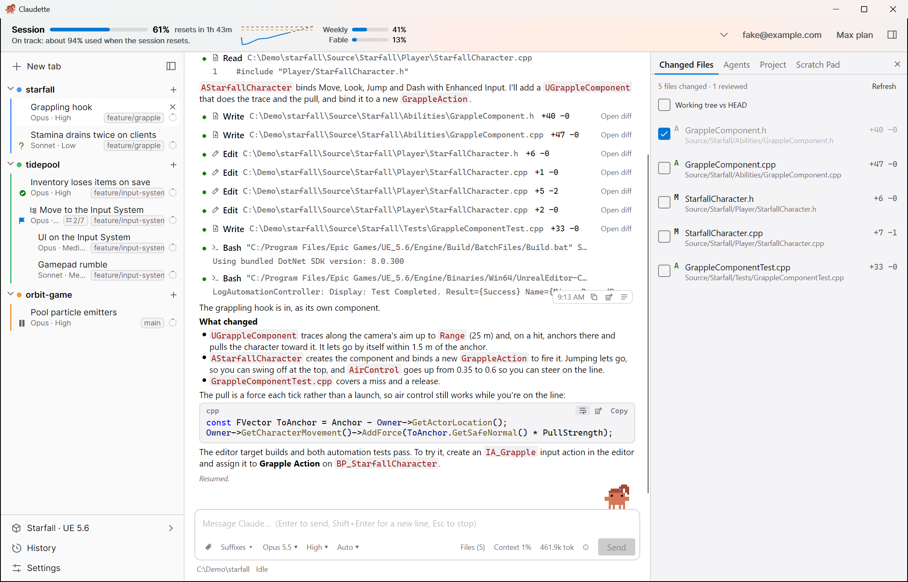</td>
    <td></td>
  </tr>
  <tr>
    <td align="center">Standard, light</td>
    <td align="center">Standard, dark</td>
  </tr>
  <tr>
    <td>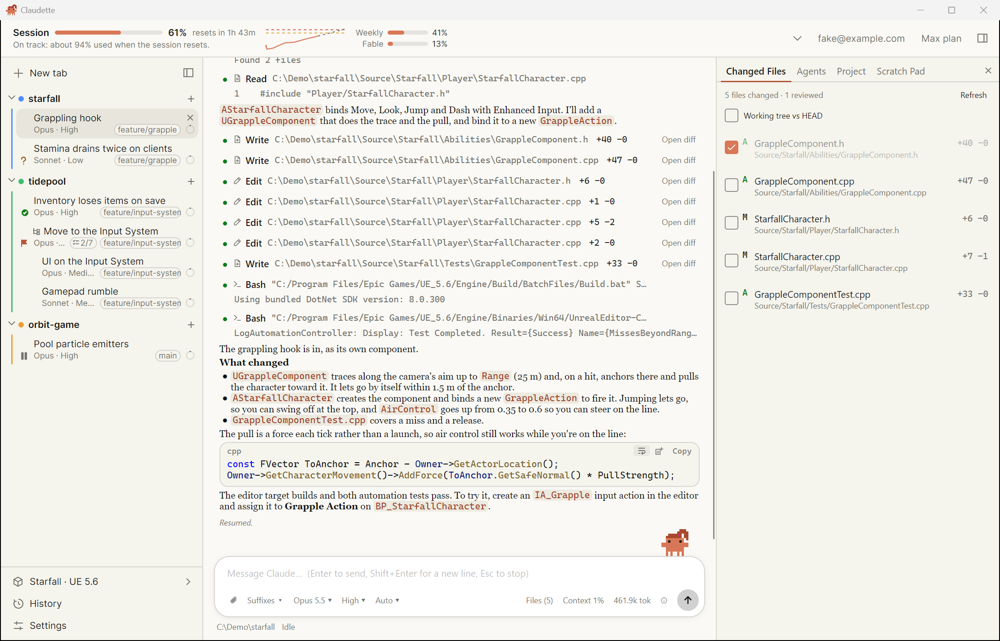</td>
    <td>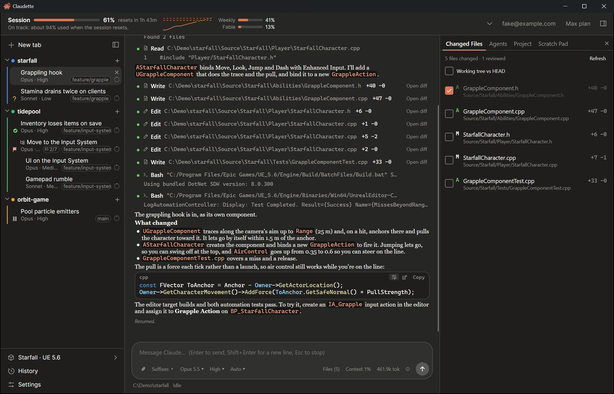</td>
  </tr>
  <tr>
    <td align="center">Claude, light</td>
    <td align="center">Claude, dark</td>
  </tr>
</table>

### Claudette keeps you company

Claudette, the app's pixel mascot, stands on the message box while you work (Settings → Appearance turns her off). She blinks and looks around, wanders about near the Send button, leans on the edge, and every so often loses her footing, falls off behind the box and climbs back up. She types on a little laptop while Claude works, waves when Claude needs you, hops when a turn finishes and dozes by an hourglass when you've hit your plan's limit. Click her to startle her (twice and she falls off). She rises with the box as you type, ducks behind it when something needs the space, and stands still if you reduce motion.

<table>
  <tr>
    <td>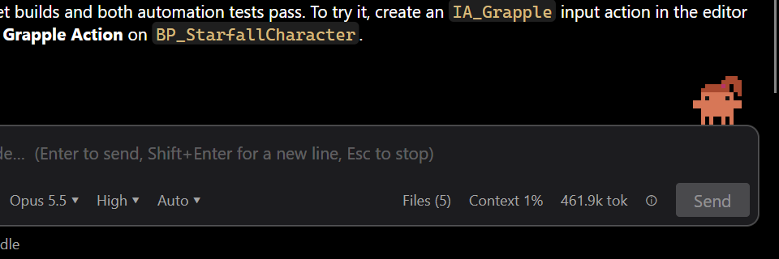</td>
    <td>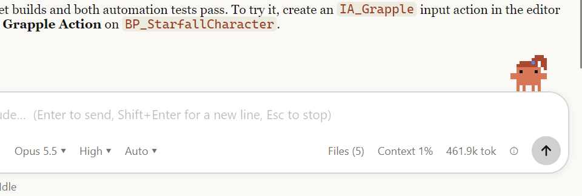</td>
  </tr>
</table>

### And the small things

Native notifications and a taskbar or Dock badge when a tab needs you. A side panel whose pages (changed files, agents, tasks, project, processes, MCP servers, the scratch pad) you can drag into your own order. Sign in from inside the app. Claude Code updates offered as they come out, and Claudette updating itself. A status dot that tells you when Claude itself is having a bad day. Start at login, a compact density, zoom from 80% to 200% and reduced motion. Settings that sync between your machines if you want them to.

## Getting started

You need [Claude Code](https://code.claude.com/docs) installed. Claudette finds `claude` on your `PATH`, and can sign you in if you aren't already.

- **Windows:** the MSIX from [Releases](https://github.com/reapazor/Claudette/releases).
- **macOS:** the `.dmg` from [Releases](https://github.com/reapazor/Claudette/releases).
- **From source** (Windows, macOS or Linux), with the .NET SDK that `global.json` names:

  ```sh
  dotnet run --project src/Claudette.App
  ```

### Try it without an account

`tools/Claudette.Demo` builds a demo, the one in these screenshots: three game projects (Unreal in C++, Unity in C#, and Godot), seven tabs including a thread with two sub-threads, past sessions for History, and a plan usage history, with a stand-in for Claude Code. It needs no account and spends no tokens.

```sh
dotnet run --project tools/Claudette.Demo -- <empty folder>
```

It prints the environment variables to start Claudette with. On Windows, `tools/Claudette.Demo/screenshots.ps1 -Projects C:\Demo` takes these screenshots again.

## Contributing

[DESIGN.md](DESIGN.md) is the spec for every feature, and [CLAUDE.md](CLAUDE.md) covers the layout, rules and commands. The tests never touch a real account: they use a fake Claude Code, a mock Messages API and recorded protocol fixtures.

```sh
dotnet build Claudette.slnx
dotnet test Claudette.slnx --filter "Category!=Live"
```

## License

[MIT](LICENSE)
